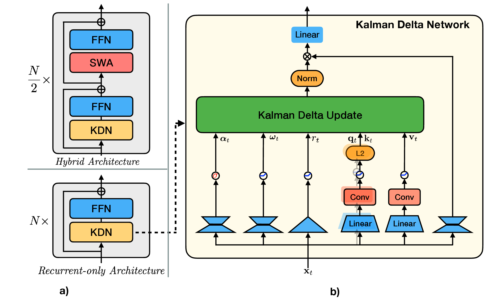

# Kalman Delta Networks

This repository provides production implementations of two
Kalman-inspired recurrent token mixers for causal language models:

- **Isotropic KDN** (`iso_kdn`) tracks one uncertainty scalar per mixer
  head and applies a scalar gain along the key direction.
- **Diagonal KDN** (`diag_kdn`) tracks uncertainty independently for every key
  channel and applies a vector-valued gain.

Both mixers retain a full per-head associative memory matrix. “Diagonal” refers
to the uncertainty approximation, not to the memory itself. The release
contains fixed production kernels and independent PyTorch recurrence oracles,
plus 1.3B-family language-model configurations.

<p align="center">
  
</p>

## Method

Let $S_t \in \mathbb{R}^{d_k \times d_v}$ be the recurrent associative
memory. At token $t$, KDN first applies channel-wise retention, then writes
the value prediction error with a Kalman-derived gain:

$$
\widehat S_t = \mathrm{Diag}(\alpha_t) S_{t-1}, \qquad
\delta_t = v_t - k_t^\top \widehat S_t, \qquad
S_t = \widehat S_t + \kappa_t \delta_t^\top.
$$

The variants differ in how they represent uncertainty and form $\kappa_t$:

| Mixer | Uncertainty state | Process noise | Write gain |
|---|---|---|---|
| Isotropic KDN | One scalar per head | One scalar per head/token | $\kappa_t = \beta_t k_t$ |
| Diagonal KDN | One value per key channel | One value per key channel/token | General vector $\kappa_t$ |

The production paths live in
[`lit_gpt/iso_kdn.py`](lit_gpt/iso_kdn.py) and
[`lit_gpt/diag_kdn.py`](lit_gpt/diag_kdn.py). Their Triton kernels and
independent mathematical references are under
[`lit_gpt/kdn_ops/`](lit_gpt/kdn_ops/).

## Released configurations

| Config name | Layers | Width | Heads × head dim | Total parameters |
|---|---:|---:|---:|---:|
| `iso_kdn_1.3B` | 18 | 2,304 | 18 × 128 | 1,449,848,592 |
| `diag_kdn_1.3B` | 18 | 2,304 | 18 × 128 | 1,449,806,796 |

The `1.3B` suffix names the approximately 1.302B-parameter transformer block
stack. Untied token embeddings and the language-model head bring the complete
model to approximately 1.45B parameters.

All four configurations use a 32,000-token vocabulary, sequence length 4,096,
LLaMA-style MLPs, fused RMSNorm, and a KDN mixer in every block.

## Requirements

The release is qualified on:

- Linux x86-64
- Python 3.11
- PyTorch 2.8.0 with CUDA 12.8
- NVIDIA H200 GPUs
- BF16 mixed-precision training

Model construction, production forwards, and training require CUDA. Building
the native dependencies requires a CUDA 12.8 toolkit with `nvcc` and Git.

## Installation

Install the Python dependencies first, then the two native CUDA packages.

```bash
export KDN_ENV=/absolute/path/to/kdn-venv
python3.11 -m venv "$KDN_ENV"
source "$KDN_ENV/bin/activate"

python -m pip install -r requirements.txt
python -m pip install --no-build-isolation "flash-attn==2.8.3"
python -m pip install --no-build-isolation \
  "flash-linear-attention @ git+https://github.com/fla-org/flash-linear-attention.git@4b02d15d6a68700181b180235be62a9fb95d2a38"
python -m pip install --no-deps -e .
python -m pip check
```

## Training

Set `WANDB_API_KEY`, then this command run the training on one 8-GPU node. The data directory must contain Parquet shards with a `text` column.

```bash
MODEL=iso_kdn_1.3B  # or diag_kdn_1.3B

python pretrain.py \
  --model_name "$MODEL" \
  --train_config tsz128x4k_100B \
  --exp_name "${MODEL}_100B" \
  --output_root /path/to/output \
  --tokenizer_path /path/to/tokenizer \
  --use_stream_tok \
  --train_data_dir_raw /path/to/fineweb-edu/100BT \
  --micro_batch_size 4 \
  --nnodes 1 \
  --devices_per_node 8
```

To continue a run, rerun the same command with `--resume`.

## Repository layout

- [`lit_gpt/config.py`](lit_gpt/config.py): released model configurations.
- [`lit_gpt/model.py`](lit_gpt/model.py): GPT backbone and mixer dispatch.
- [`lit_gpt/iso_kdn.py`](lit_gpt/iso_kdn.py): Isotropic KDN layer.
- [`lit_gpt/diag_kdn.py`](lit_gpt/diag_kdn.py): Diagonal KDN layer.
- [`lit_gpt/kdn_ops/`](lit_gpt/kdn_ops/): production kernels and PyTorch
  reference recurrences.
- [`pretrain.py`](pretrain.py): distributed training driver and checkpoint
  protocol.

## Acknowledgements

This codebase builds on
[Gated DeltaNet-2](https://github.com/NVlabs/GatedDeltaNet-2),
[LitGPT](https://github.com/Lightning-AI/litgpt), and
[Flash Linear Attention](https://github.com/fla-org/flash-linear-attention).
